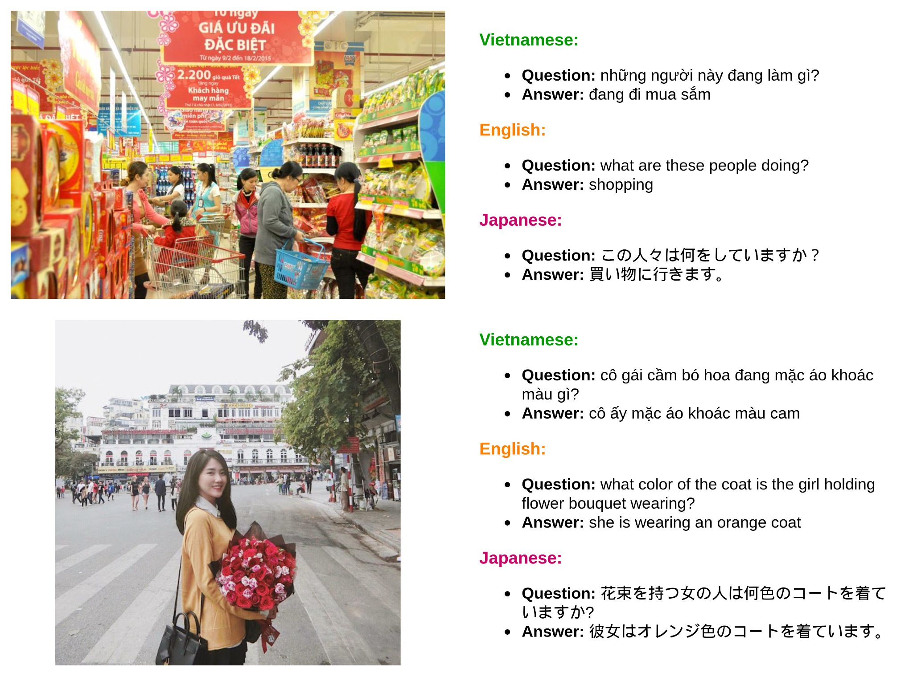

## VLSP 2022 – EVJVQA Challenge: Multilingual Visual Question Answering

### Task Description

Multilingual Visual Question Answering (mVQA) is a challenging task that has gradually gained attraction and made substantial progress in recent years. mVQA is also one of the potential tasks with a combination of Computational Linguistics and Computer Vision. Based on an image and a question about it, an mVQA system can predict correct answers in several languages. Although the task is simple for humans, it is a challenge for computers. 

UIT-EVJVQA, the first multilingual Visual Question Answering dataset with three languages: English, Vietnamese, and Japanese, is released in this task. UIT-EVJVQA includes question-answer pairs created by humans on a set of images taken in Vietnam, with the answer created from the input question and the corresponding image. UIT-EVJVQA consists of about 30K question-answer pairs for evaluating the mQA models. To perform effectively in UIT-EVJVQA, the VQA systems must not only answer monolingual questions but also identify and predict correct answers for multilingual questions. Participating teams will utilize the UIT-EVJVQA dataset to evaluate visual question-answer models in this task.

### Dataset Information

UIT-EVJVQA dataset with about 30K question-answer pairs on approximately 5,000 images taken in Vietnam is provided to participating teams. The dataset is stored as.json files. Several examples of the multilingual Visual Question Answering task in VLSP 2022 are shown below.

### Evaluation Metrics

Two evaluation metrics: Accuracy and BLEU are used for this challenge. In particular, BLEU is the average score of BLEU-1, BLEU-2, BLEU-3, and BLEU-4 as the evaluation metric for visual question answering. The final ranking is evaluated on the test set according to Accuracy (BLUE as a secondary metric when there is a tie). 

